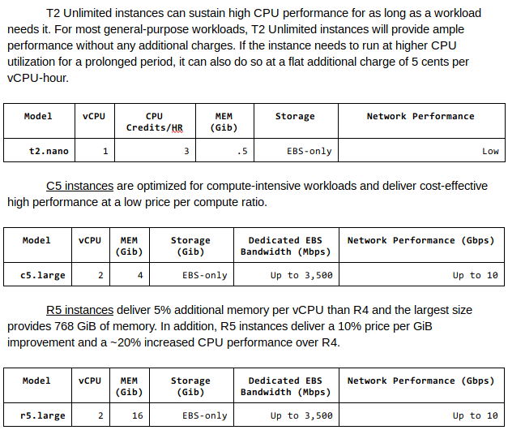

--------------------------------------------------------------------------------------------------------------------------------
Specs:

    Ubuntu 18.04
    Python 3.6

--------------------------------------------------------------------------------------------------------------------------------
Run Times:

--------------------------------------------------------------------------------------------------------------------------------
Analysis:

Before providing an analysis I will lay out some observations of the files and the instances, the tables below were taken from Amazon's website describe instance types.:

Opening each of the files in an editor I’ve also noticed that free_1.vcf and premium_2.vcf have consistent data each consisting of roughly 1000 - 1100 lines of code.

However premium_1.vcf seems to have inconsistent data in the POS, ID, REF, ALT, QUAL and FILTER columns which hinders performance.

Each of the instance types can all agree that premium_1.vcf  has the slowest performance across the board, however out of all of the instance types r5.large had the best performance slightly ahead of t2.nano with c5.large last.

This is mostly due to the fact that r5.large  has the best performance in memory bound applications such as the example in class of trade transactions. This instance is good at performing large amounts of lightweight transactions which is what the genome analysis files are comprised of.

Whereas c5.large  is compute optimized for moderate amounts of large transactions and t2.nano is generally good overall.

This explains why the instances reacted different to the file types, however, there were still inconsistent fluctuations when running an annotation on an instance type during the three trials at different times.

I finished these trials on wednesday 4/10/19 and I reran a few more trials for fun on sunday 4/14/19 and noticed a dramatic increase in times (over 8x longer!)

--------------------------------------------------------------------------------------------------------------------------------
Comments:
